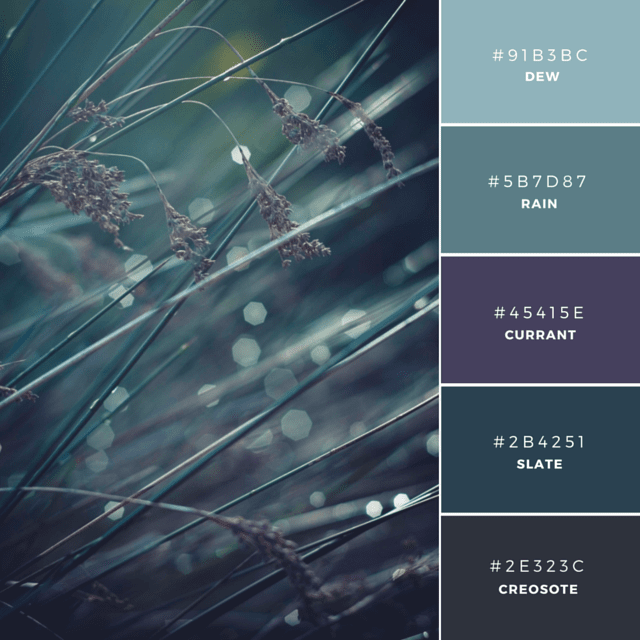

# Palette : [Morning Mist](https://www.canva.com/learn/brand-color-palette/)

Dense hues form a strong, masculine  combination and the easy transition from swatch to swatch creates a  calming effect. These colors are 'analogous', which means they sit near  each other in the color wheel. The rich and dark tones would be well  suited to the industrial or building industry.'

With business cards for instance, color plays a significant role in  communicating the type of service you offer. Since you won't be writing  many words, take time to choose a color palette that you can use across  all your branding collateral. If you'd like to have a go, try our [Dark Masculine Barber Shop business card](https://canva.me/sXoIhevi0P), or our [Blue and White Buildings Silhouette Taxi business card](https://canva.me/gdpQHEzi0P) templates.