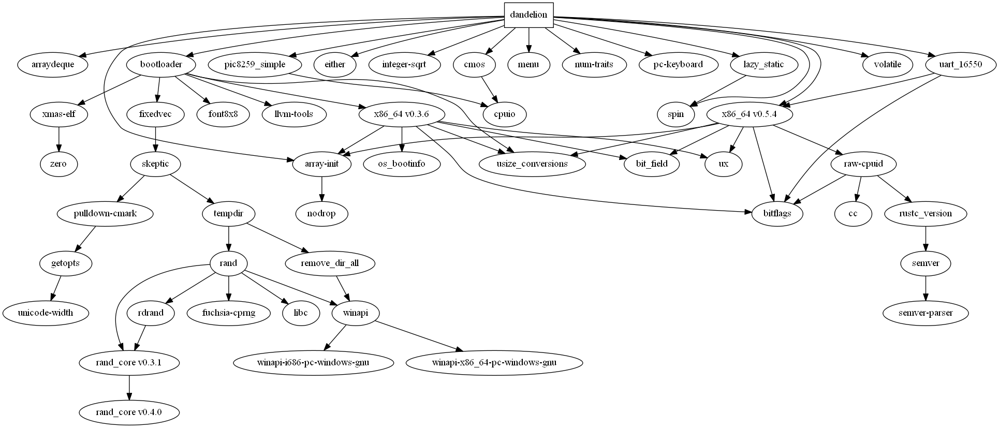

# Microkernel Real-time Operating System in Rust

[Antoine Sébert](mailto:antoine.sb@orange.fr)[^author]

09/02/2019

> “The tools we use have a profound and devious influence on our thinking habits, and therefore on our thinking abilities”
> E. W. Dijkstra

## Abstract

This document demonstrates the feasibility of a microkernel RTOS that aims to enforce the reliability of the system by taking advantage of the Rust programming language’s characteristics.

The system is able to schedule and run tasks with strict timed constraints, both periodic & aperiodic, and also supports non-realtime tasks without guaranty of completion. The size of the program has been kept relatively small to fit the majority of embedded devices.

The Rust language is very likely to become a tool of choice within the next couple of years, yet the temporary but pervasive instability of the development environment is a serious concern.

## Categories and Subject Descriptors

### ACM classifiers

• **Computer systems organization~Real-time operating systems**

• *Software and its engineering~Real-time schedulability*

• Software and its engineering~Multiparadigm languages

### Keywords

Real-Time, Operating System, RTOS, microkernel, Rust

## Introduction

Real-time Operating Systems are widely used in several sectors, including astronautics, mainframes, aeronautics, robotics, or embedded systems in general (and IoT in particular) [**Andrews et al., 2005**], for their predictability and deterministic behavior [**Schmidt, 2000; Ip, 2001**]. They are typically more tolerant to failures and more predictable [**Aroca & Caurin, 2009; Nelson et al., 2014**], and particular care is taken about the implementation and the tests [**Kirsch et al., 2005**].

However, the emergence of modern programming languages for systems development, that intent to address the drawbacks of older programming languages [**Balasubramanian et al., 2017**], question the choice of the ubiquitous C/C++ or Java as default choices for such projects [**Orozco & Santos, 2012**]. This brings us to Rust: originally created by Graydon Hoare, who worked at the Mozilla Foundation, it is now developed by the Rust project developers, centered around the language's Github repository[^1].

Designed to be fast and reliable, this language is memory safe, uses Resource Acquisition Is Initialization (RAII) to manage memory (avoiding the necessity of a garbage collector), supports polymorphism and natively supports concurrency [**Matsakis & Klock, 2014**]. It is often cited as a potential successor of C++.

Whereas the majority of current RTOS have been conceived when Rust did not exist, they are written in languages that show their limits when it comes to real-time computing, or lack the desirable features [**Burns & Wellings, 2009**]. Hence a RTOS implemented in Rust seems very promising. Very few attempts in this area have been made [**Heldring, 2018**], and yet real-time computing is a growing field in the need for a new generation of RTOS aimed to solve arising challenges.

It is planned to design and develop the kernel of a real-time operating system that focuses on the essential features and demonstrates the scheduling of multiple processes with time-bound constraints and static priority (to prevent priority inversion issues) [**Buttazzo, 2011; Yodaiken, 2004**]. The tasks can be aperiodic (deadline), periodic (interval) or non-realtime. Inter-process communication by message-passing [**Tzou & Anderson, 1991; Liedtke, 2004**] between the processes is also wished. The system will be written in pure Rust and take advantage of the language’s features to achieve performance and reliability [**Barbalace et al., 2008; Matsakis & Klock, 2014**]. The operating system size must also be kept small so as to eventually target embedded systems [**Zuberi & Shin, 2001; Nelson et al., 2014**].

## Methodology

### Toolchain and environment

#### Rust

Rust, for it has been guaranteed free from common problems related to memory (data races, null pointers, *etc*) [**Jung et al., 2017**] while remaining almost as fast as C/C++[^2]. Rust’s ecosystem is also quickly expanding, partly because it supported by the Mozilla Foundation (especially in its product Firefox), and partly because the community endlessly creates new open source software projects[^3]. It has also a very good reputation[^4] amongst the developers that use it.

**Note on version numbers**: all version below “*1.0.0*“ and nightly versions are considered unstable and can break at any time for any reason, according to the Semver[^5] versioning system [**Preston-Werner, 2015; Raemaekers et al., 2017**].

##### Toolchain

The toolchain (including the compiler and its most important components) can be installed via rustup[^6]. The chosen toolchain is the nightly version of the compiler for the host OS defined by the target triplet[^7] *x86_64-pc-windows-msvc*.

| component          | function                                               | version        |
| ------------------ | ------------------------------------------------------ | -------------- |
| rustc[^8]          | Rust compiler                                          | 1.34.0-nightly |
| cargo[^9]          | package manager and build tool                         | 1.34.0-nightly |
| rustfmt[^10]       | formatting tool                                        | 1.1.0-nightly  |
| clippy[^11]        | linter                                                 | 0.0.212        |
| rust-src           | Rust source code                                       | *null*         |
| llvm-tools-preview | binary inspection and profiling, required by bootimage | 0.1.1          |
| cargo-xbuild[^12]  | cross-compiles `core`, builtins, and alloc             | 0.5.5          |
| bootimage[^13]     | creates a bootable disk image from an OS binary        | 0.7.3          |

##### Dependencies

###### Graph



###### Table

| Name                | Description                                                  | version |
| ------------------- | ------------------------------------------------------------ | ------- |
| bootloader[^14]     | Tool to create a bootable OS image from a kernel binary.<br />Enabling the feature `map_physical_memory` maps the physical memory into the virtual address space. All the physical memory can then easily be accessed by the kernel. This approach has been preferred to the 4-level page hierarchy (feature `recursive_page_table`) for it is simpler. | ^0.6    |
| volatile[^15]       | A simple volatile wrapper type.                              | ^0.2    |
| uart_16550[^16]     | Minimal support for uart_16550 serial output.                | ^0.2    |
| x86_64[^17]         | Support for x86_64 specific instructions (e.g. TLB flush), registers (e.g. control registers), and structures (e.g. page tables). | ^0.5    |
| pic8259_simple[^18] | Kernel-space interface to 8259 and 8259A Programmable Interrupt Controller. | ^0.1    |
| integer-sqrt[^19]   | This module contains the single trait `IntegerSquareRoot` and implements it for primitive integer types. | ^0.1    |
| cmos[^20]           | A utility to read, write CMOS and RTC data. Standard library not required. The crate has been forked to extend its features[^21]. | ^0.1    |
| array-init[^22]     | Safe wrapper for initializing fixed-size arrays.             | ^0.0    |
| pc-keyboard[^23]    | PS/2 keyboard interface library.                             | ^0.5    |
| spin[^24]           | Synchronization primitives based on spinning. They may contain data, are usable without `std`, and static initializers are available. | ^0.5    |
| arraydeque[^25]     | A ring buffer with a fixed capacity, which can be stored on the stack. | ^0.4    |
| either[^26]         | The enum `Either` with variants `Left` and `Right` is a general purpose sum type with two cases. The crate’s default features have been disabled to work in a `no_std` context. | ^1.5    |
| num-traits[^27]     | Numeric traits for generic mathematics in Rust. The crate’s default features have been disabled to work in a `no_std` context. | ^0.2    |
| lazy_static[^28]    | A macro for declaring lazily evaluated statics in Rust. Enabling the feature `spin_no_std` to make use of the crate possible in a `no_std` context. | ^1.3    |

##### The `no_std` context

Since standard libraries are developed for a particular implementation of a programming language, it depends on the operating system. But in the case of the creation of an operating system, no standard library is available, unless written by the developers. Within the context of *Rust*, that also includes `collections`, a module containing common data structures, and stack overflow protection. There is also no dynamic memory (provided by the OS).

The following table retrieved from https://rust-embedded.github.io/book/intro/no-std.html sums up the main differences.

| feature                                      | no_std | std  |
| -------------------------------------------- | ------ | ---- |
| heap (dynamic memory)                        | *      | ✓    |
| collections (Vec, HashMap, etc)              | **     | ✓    |
| stack overflow protection                    | ✘      | ✓    |
| runs init code before main                   | ✘      | ✓    |
| libstd available                             | ✘      | ✓    |
| libcore available                            | ✓      | ✓    |
| writing firmware, kernel, or bootloader code | ✓      | ✘    |

\* Only if you use the `alloc` crate and use a suitable allocator like [alloc-cortex-m](https://github.com/rust-embedded/alloc-cortex-m).
** Only if you use the `collections` crate and configure a global default allocator.

#### Target Specification

Since we are creating a custom OS, we have to define our own target platform in the file `x86_64-dandelion.json`. The target architecture is then passed to *cargo* as a parameter by *bootimage* to use the cross-compilation feature of *rustc*.

```json
{
	"llvm-target": "x86_64-unknown-none",
	"data-layout": "e-m:e-i64:64-f80:128-n8:16:32:64-S128",
	"arch": "x86_64",
	"target-endian": "little",
	"target-pointer-width": "64",
	"target-c-int-width": "32",
	"os": "none",
	"executables": true,
	"linker-flavor": "ld.lld",
	"linker": "rust-lld",
	"panic-strategy": "abort",
	"disable-redzone": true,
	"features": "-mmx,-sse,+soft-float"
}
```

* `"llvm-target": "x86_64-unknown-none"`: the target is 64-bit architecture, unknown manufacturer, without OS

* `"data-layout": "e-m:e-i64:64-f80:128-n8:16:32:64-S128"`: the target’s data layout[^29]

* `"arch": "x86_64"`: the program runs on 64-bit architecture

* `"target-endian": "little"`: the target use little form of endianness

* `"target-pointer-width": "64"`: a pointer has a size of 64 bits (from `0x0000000` to `0xffffffff`)

* `"target-c-int-width": "32"`: an unsigned integer has a size of 32 bits

* `"os": "none"`: the program will run on bare metal

* `"executables": true`: *no documentation found*

* `"linker-flavor": "ld.lld"`: do not use the platform's default linker for cross-compilation reasons

* `"linker": "rust-lld"`: use the LLD linker that is part of Rust’s toolchain

* `"panic-strategy": "abort"`: in case of kernel panic, the programs abort because stack unwinding (popping one or more frames off the stack to resume execution elsewhere in the program) is not supported.

* `"disable-redzone": true`: the redzone is an optimization that makes place for temporary data on a function's stack. In case of an interruption, the exception handler can overwrite the data in the redzone, leading to stack corruption. Thus it has been disabled.

* `"features": "-mmx,-sse,+soft-float"`: the MMX and SSE instructions set from the SIMD class[^30] are disabled because they lead to significant performance loss. And since the SSE is used as FPU, the floating-point operations have to be emulated by integers with `soft-float`, causing performance loss[^unproven].

#### Qemu

To run the OS, the QEMU[^31] emulator version 3.1.0 has been chosen. It is widely-used and aims for speed, plus supports a large choice of hardware platforms[^32].

### Design

#### Essential characteristics

This project aims to reach three defined goals  :

- **deterministic** execution time of the programs (or subparts of them), allowing the processes to be managed accurately

- **correctness** of the time when a result is expected, to meet or miss the deadlines, where treatment marks the difference between soft and hard RTOS

- **predictability** of the deadline associated with a set of constraints to define an expected state of the system

##### Microkernel OS architecture

Since the project aims to demonstrate that creating a microkernel RTOS in Rust in now possible, it focuses on essential components: paged memory allocation, text printing on screen, clock management, interrupts and process scheduling [**Hansen, 1970**].

The memory print must be kept small, so as to be able to fit on low memory systems :

- source code size: less than 10.000 lines (including code + comments + blanks)

- OS image file size: less than 100.000.000 bytes (including the bootloader)

Unfortunately sufficient documentation on the topic of typical embedded system OS size could not be performed, so the values above are arbitrary, however, it is clear that they are extremely low.

##### Firm real-time

Originally designed to be a hard-realtime system, the philosophy switched to firm-deadline during the development process. We do believe that total system failure on a missed deadline is the opposite of the reliability a RTOS aims to achieve, thus time-bound constraints are tied to the quality of service instead, allowing a more flexible behavior.

##### Time-sharing

Since the nature of the project does not bring the efforts on input/output management, the time-sharing scheduling has been chosen. It also allows testing the scheduler more easily, since the environment is more deterministic.

The dispatcher component of the scheduler is triggered by the real-time clock at regular intervals that can be defined at compile time. In the default configuration, the interrupt is called twice a second.

File: `src/kernel/interrupts.rs`

``````rust
pub fn change_rtc_interrupt_rate(mut rate: u8) {
	rate &= 0x0F; // rate must be above 2 and not over 15, by default 6
	without_interrupts(|| {
		let mut address_port = Port::<u8>::new(0x70);
		let mut data_port = Port::<u8>::new(0x71);

		unsafe {
			address_port.write(0x8A);
			let prev: u8 = data_port.read();
			address_port.write(0x8A);
			data_port.write((prev & 0xF0) | rate);
		}
	});

	println!("New frequency is {}", 32768 >> (rate - 1));
}
``````

##### Scheduling

Classified depending on the level, the three components are described as follows :

- *swapper*: Run the first element in the ready queue (if there is no element, no process is to run). If there is already an element running, it is moved at the end of the ready queue.
- *dispatcher*: Move processes between the ready queue and blocked queue, is responsible for terminating processes those deadlines have been missed, and order processes within the ready queue according to a scheduling strategy
- *admitter*: Determines whether a process request is schedulable or not, with the current context. Creates a process from the request and add it to the process table and the ready queue.

Two components implement problem-solving algorithms: the admitter and the dispatcher. The admitter uses a rate monotonic approach [**Liu & Layland, 1973; Buttazzo, 2005**] to determine whether or not a process is schedulable, and the dispatcher use by default a modified version of the EDF algorithm that allows partial priority preemption. Strategies for both components are defined in a submodule `strategy` to keep the code organised.

Several data structures, declared in `src/kernel/scheduler/mod.rs`, support this model:

* `PROCESS_TABLE: [RwLock<Option<Task>>; 256]`: stores all active processes, regardless of their state. A process’ PID is its index within the table. Used by the *admitter*.
* `BLOCKED_QUEUE: Mutex<ArrayDeque<[u8; 256]>>`: stores the PID of blocked processes. Used by the *dispatcher* and the *swapper*.
* `READY_QUEUE: Mutex<ArrayDeque<[u8; 256]>>`: stores the PID of ready processes. Used by the *admitter*, the *dispatcher* and the *swapper*.
* `RUNNING: RwLock<Option<u8>>`: stores the PID of the running process. Used by the *swapper*.
* `PROCESS_COUNT: RwLock<u8>`: stores the count of current processes, updated by the *admitter*. Allows to quickly get an accurate process count without locking the whole process table.

Of course, this is a straightforward approach, and more complex and adequate solutions do exist [**Buttazzo & Stankovic, 1995**].

###### Admitter

The program first start to select the realtime tasks from the process table. It then calculates the rate and return the result of:

 $\sum_{i=1}^{n} \frac{C_i}{T_i} \leq n({2}^{1/n} - 1)$

```rust
pub fn rate_monotonic(constraint: Constraint) -> bool {
	let realtime_tasks: ArrayDeque<[RwLockWriteGuard<Option<Task>>; 256]> = {
		let mut temp: ArrayDeque<_> = ArrayDeque::new();
		for element in PROCESS_TABLE.iter() {
			let guard = element.read();
			if let Some(v) = *guard {
				if get_realtime(&v).is_some() {
					// capacity error should never happen if PROCESS_TABLE and realtime_tasks have the same size
					if let Ok(()) = temp.push_back(element.write()) {}
				}
			}
			drop(guard);
		}
		temp
	};

	let rate: f64 = {
		let mut temp = 0.0;

		for task in realtime_tasks.iter() {
			temp += match get_realtime(&(task).unwrap()).unwrap() {
				Left(periodic) => periodic.0.as_secs() as f64 / periodic.1.as_secs() as f64,
				Right(_) => get_estimated_remaining_time(&(task).unwrap()).as_secs() as f64 / 256_f64,
			}
		}

		temp += match constraint.0.unwrap() {
			Left(periodic) => periodic.0.as_secs() as f64 / periodic.1.as_secs() as f64,
			Right(aperiodic) => aperiodic.0.as_secs() as f64 / 256_f64,
		};

		temp
	};

	let n = realtime_tasks.len();

	for guard in realtime_tasks {
		drop(guard);
	}

	rate < (n as f64) * (pow(2.0, 1 / n) - 1.0)
}
```

###### Dispatcher

**`process_id`**

This strategy simply orders the processes by PID. it has no particular interest and is used for demonstration purposes.

```rust
/// Put the processes in READY_QUEUE by order of PID.
/// Return the PID of the first process in the ready queue if it exists.
pub fn process_id(queue: &Mutex<ArrayDeque<[u8; 256]>>) -> Option<u8> {
	let mut guard = queue.lock();

	((*guard).as_mut_slices().0).sort_unstable();
	let first_value = Some(*(*guard).front().unwrap());

	drop(guard);
	first_value
}
```

**`priority`**

This strategy simply orders the processes by priority. No difference between real-time and non-realtime tasks is made.

```rust
/// Put the processes in READY_QUEUE by order of priority.
/// Return the PID of the first process in the ready queue if it exists.
pub fn priority(queue: &Mutex<ArrayDeque<[u8; 256]>>) -> Option<u8> {
	let mut guard = queue.lock();

    ((*guard).as_mut_slices().0).sort_unstable_by(|a, b| {
		use core::cmp::Ordering::Equal;
	
		let pt_guard = PROCESS_TABLE[*a as usize].read();
		let priority_a = get_priority(&(*pt_guard).unwrap());
		drop(pt_guard);
		let pt_guard = PROCESS_TABLE[*b as usize].read();
		let priority_b = get_priority(&(*pt_guard).unwrap());
		drop(pt_guard);
	
		match priority_a.partial_cmp(&priority_b) {
			Some(ord) => ord,
			None => Equal,
		}
	});
	let first_value = Some(*(*guard).front().unwrap());
	
	drop(guard);
	first_value
}
```

**`earliest_deadline_first`**

This strategy orders the tasks by deadline (for both periodic and aperiodic tasks). Non-realtime tasks always have a weaker ordering when compared with real-time tasks.

```rust
/// Put the processes in READY_QUEUE by order of deadline and priority.
/// Return the PID of the first process in the ready queue if it exists.
pub fn earliest_deadline_first(queue: &Mutex<ArrayDeque<[u8; 256]>>) -> Option<u8> {
	let mut guard = queue.lock();

	((*guard).as_mut_slices().0).sort_unstable_by(|a, b| {
		use core::cmp::Ordering::*;
		use either::{Left, Right};

		let pt_guard = PROCESS_TABLE[*a as usize].read();
		let realtime_a = get_realtime(&(*pt_guard).unwrap());
		drop(pt_guard);
		let pt_guard = PROCESS_TABLE[*b as usize].read();
		let realtime_b = get_realtime(&(*pt_guard).unwrap());
		drop(pt_guard);

		match (realtime_a, realtime_b) {
			(None, None) => Equal,
			(None, Some(_)) => Less,
			(Some(_), None) => Greater,
			(Some(periodicity_a), Some(periodicity_b)) => {
				match (periodicity_a, periodicity_b) {
					(Right(aperiodic_a), Right(aperiodic_b)) => match aperiodic_a.1.partial_cmp(&aperiodic_b.1) {
						Some(ord) => ord,
						None => Equal,
					}
					(Right(aperiodic_a), Left(periodic_b)) => match aperiodic_a.0.partial_cmp(&periodic_b.1) {
						Some(ord) => ord,
						None => Equal,
					}
					(Left(periodic_a), Right(aperiodic_b)) => match periodic_a.1.partial_cmp(&aperiodic_b.0) {
						Some(ord) => ord,
						None => Equal,
					}
					(Left(periodic_a), Left(periodic_b)) => match periodic_a.2.partial_cmp(&periodic_b.2) {
						Some(ord) => ord,
						None => Equal,
					}
				}
			}
		}
	});
	let first_value = Some(*(*guard).front().unwrap());

	drop(guard);
	first_value
}
```

**`modified_earliest_deadline_first`**

The following algorithm is used by default. Since it is mainly composed of `match` statements, it is very verbose but yet fast. However, it could be refactored with closures.

```rust
/// Put the processes in READY_QUEUE by order of deadline and priority.
/// LOW can preempt MEDIUM, MEDIUM can preempt HIGH.
/// Return the PID of the first process in the ready queue if it exists.
pub fn modified_earliest_deadline_first(queue: &Mutex<ArrayDeque<[u8; 256]>>) -> Option<u8> {
	let mut guard = queue.lock();

	((*guard).as_mut_slices().0).sort_unstable_by(|a, b| {
		use crate::kernel::process::PRIORITY::{self, *};
		use core::cmp::Ordering::{self, *};
		use either::{Left, Right};

		let pt_guard = PROCESS_TABLE[*a as usize].read();
		let process = (*pt_guard).unwrap();
		let constraint_a = get_constraint(&process);
		drop(pt_guard);
		let pt_guard = PROCESS_TABLE[*b as usize].read();
		let process = (*pt_guard).unwrap();
		let constraint_b = get_constraint(&process);
		drop(pt_guard);

		match (constraint_a.0, constraint_b.0) {
			(None, None) => {
				match constraint_a.1.partial_cmp(&constraint_b.1) {
					Some(ord) => ord,
					None => Equal,
				}
			}
			(None, Some(_)) => Less,
			(Some(_), None) => Greater,
			(Some(periodicity_a), Some(periodicity_b)) => {
				match (periodicity_a, periodicity_b) {
					(Right(aperiodic_a), Right(aperiodic_b)) => {
						match aperiodic_a.1.partial_cmp(&aperiodic_b.1) {
							Some(ord) => {
								match (constraint_a.1, constraint_b.1) {
									(HIGH, MEDIUM) => Greater,
									(MEDIUM, LOW) => Greater,
									(HIGH, LOW) => Greater,
									(LOW, MEDIUM) => Less,
									(MEDIUM, HIGH) => Less,
									_ => ord,
								}
							}
							None => {
								match constraint_a.1.partial_cmp(&constraint_b.1) {
									Some(ord) => ord,
									None => Equal,
								}
							}
						}
					}
					(Right(aperiodic_a), Left(periodic_b)) => {
						match aperiodic_a.0.partial_cmp(&periodic_b.1) {
							Some(ord) => {
								match (constraint_a.1, constraint_b.1) {
									(HIGH, MEDIUM) => Greater,
									(MEDIUM, LOW) => Greater,
									(HIGH, LOW) => Greater,
									(LOW, MEDIUM) => Less,
									(MEDIUM, HIGH) => Less,
									_ => ord,
								}
							}
							None => {
								match constraint_a.1.partial_cmp(&constraint_b.1) {
									Some(ord) => ord,
									None => Equal,
								}
							}
						}
					}
					(Left(periodic_a), Right(aperiodic_b)) => {
						match periodic_a.1.partial_cmp(&aperiodic_b.0) {
							Some(ord) => {
								match (constraint_a.1, constraint_b.1) {
									(HIGH, MEDIUM) => Greater,
									(MEDIUM, LOW) => Greater,
									(HIGH, LOW) => Greater,
									(LOW, MEDIUM) => Less,
									(MEDIUM, HIGH) => Less,
									_ => ord,
								}
							}
							None => {
								match constraint_a.1.partial_cmp(&constraint_b.1) {
									Some(ord) => ord,
									None => Equal,
								}
							}
						}
					}
					(Left(periodic_a), Left(periodic_b)) => {
						match periodic_a.2.partial_cmp(&periodic_b.2) {
							Some(ord) => {
								match (constraint_a.1, constraint_b.1) {
									(HIGH, MEDIUM) => Greater,
									(MEDIUM, LOW) => Greater,
									(HIGH, LOW) => Greater,
									(LOW, MEDIUM) => Less,
									(MEDIUM, HIGH) => Less,
									_ => ord,
								}
							}
							None => {
								match constraint_a.1.partial_cmp(&constraint_b.1) {
									Some(ord) => ord,
									None => Equal,
								}
							}
						}
					}
				}
			}
		}
	});
	let first_value = Some(*(*guard).front().unwrap());

	drop(guard);
	first_value
}
```

#### Operating System hierarchy

*Rust/cargo* projects are modular by default, with the project hierarchy following the file hierarchy within the guest OS.

The entry point is defined in *main.rs*, while *lib.rs* stores code to be used as part of the crate’s library and *mod.rs* refers to the local module’s root. Every other file is a module by itself, and submodules within files can also be defined. As a result, the code organization sticks to the final organization of the program.

```
--src/
  +--bin/
  |  +--test-basic-boot.rs
  |  +--test-exception-breakpoint.rs
  |  +--test-exception-double-fault-stack-overflow.rs
  |  +--test-firm-deadline-exception.rs
  |  +--test-hard-deadline-exception.rs
  |  +--test-panic.rs
  |  +--test-soft-deadline-exception.rs
  |  +--test-task-remaining-exception.rs
  |  +--test-time-remaining-exception.rs
  +--kernel/
  |  +--ipc/
  |  |  +--mod.rs
  |  +--scheduler/
  |  |  +--mod.rs
  |  |  +--admitter.rs
  |  |  +--dispatcher.rs
  |  |  +--swapper.rs
  |  +--shell/
  |  |  +--mod.rs
  |  +--vmm/
  |  |  +--mod.rs
  |  |  +--gdt.rs
  |  |  +--memory.rs
  |  +--mod.rs
  |  +--acpi.rs
  |  +--interrupt.rs
  |  +--process.rs
  |  +--serial.rs
  |  +--time.rs
  |  +--vga_buffer.rs
  +--lib.rs
  +--main.rs
```

#### Booting steps

```flow
st=>start: Start
op0=>operation: Kernel build
op1=>operation: Bootloader build
op2=>operation: Link kernel to bootloader
op3=>operation: Create disk image
op4=>operation: Run disk image in QEMU
e=>end

st->op0->op1->op2->op3->op4->e
```

#### Activity steps

```flow
st=>start: Start
io0=>inputoutput: Hello World
sub0=>subroutine: Initialize `gdt` and interrupts
sub1=>subroutine: Map kernel inot memory
cond=>condition: Processes to run ?
sub2=>subroutine: Schedule and run processes
io1=>inputoutput: It did not crash
sub3=>subroutine: infinite loop
e=>end

st->io0->sub0->sub1->cond
cond(yes)->sub2->io1->sub3->e
cond(no)->e
```

## Results

### Features

#### RTC and time-duration

So as to work with timestamps as accurate as possible, the real-time clock has been preferred to the timer. However, a dummy timer’s interrupt handler is present in the OS, making the component ready-to-use. Both timer and real-time clock are managed through the PIC controller.

The `cmos` crate provide an interface to use the real-time clock. In adequacy to the registers in the component, a timestamp is represented as follows :

```rust
pub struct RTCDateTime {
    pub second: u8,
    pub minute: u8,
    pub hour: u8,
    pub day: u8,
    pub month: u8,
    pub year: usize,
}
```

Several functions have been implemented to perform conversions between `RTCDateTime` and `Duration`, part of `core`. Code optimizations are possible.

#### Tasks with time-bound constraints

##### Process states

```rust
#[derive(Debug, Clone, Copy, PartialEq, Eq)]
pub enum State {
	Limbo(Limbo),
	MainMemory(MainMemory),
	SwapSpace(SwapSpace),
}

#[derive(Debug, Clone, Copy, PartialEq, Eq)]
pub enum Limbo {
	Creating,
	Killed,
	Terminated,
}

#[derive(Debug, Clone, Copy, PartialEq, Eq)]
pub enum MainMemory {
	Ready,
	Running,
}

#[derive(Debug, Clone, Copy, PartialEq, Eq)]
pub enum SwapSpace {
	Interrupted,
	Suspended,
	Delayed,
}
```

##### Process priority

The process priority is static. Several traits are being derived to provide basic functionality.

```rust
#[derive(Debug, Clone, Copy, PartialEq, Eq, Ord, PartialOrd)]
pub enum PRIORITY {
	HIGH,
	MEDIUM,
	LOW,
}
```
##### Process as type alias

The type aliases do not actually create new types, but rather constitute a new identifier for an existing type that disappears after compilation. In this project, most of the type aliases are tuples that encapsulate other types so as to create a coherent descriptor hierarchy for any process type supported.

```rust
pub type Arguments<'a> = &'a [&'a str];

pub type Periodic = (Duration, Duration, RTCDateTime);
pub type Aperiodic = (Duration, RTCDateTime, Option<RTCDateTime>);

pub type Info = (State, Duration, RTCDateTime);
pub type Constraint = (Option<Either<Periodic, Aperiodic>>, PRIORITY);

pub type Metadata = (Constraint, Info);

pub type Runnable = fn(Arguments) -> u64;
pub type Task = (Metadata, Runnable);

pub type Job<'a> = (Metadata, &'a [&'a Runnable]);
pub type Group<'a> = &'a [&'a Task];
```

### Commands

Assuming the current working directory is the operating system’s directory.

Build & run :
````
bootimage run -- -serial mon:stdio -device isa-debug-exit,iobase=0xf4,iosize=0x04
````

Create a bootable device from the kernel image (with *sdX* as target device mounting point):
````
dd if=target/x86_64-dandelion/debug/bootimage-dandelion.bin of=/dev/sdX && sync
````

### Tests

#### Command

This command runs the test files in `src/bin`. For each test file, an OS image file is built and run. This allows unit tests not to interfere with other tests.

````
bootimage test
````

### Code statistics

#### Command

```
tokei ./src --files
```

#### Table

| Language                                            | Files | Lines | Code | Comments | Blanks |
| --------------------------------------------------- | ----- | ----- | ---- | -------- | ------ |
| Rust                                                | 27    | 2214  | 1531 | 338      | 345    |
| `lib.rs`                                            |       | 29    | 16   | 7        | 6      |
| `main.rs`                                           |       | 112   | 66   | 25       | 21     |
| `bin\test-basic-boot.rs`                            |       | 35    | 24   | 5        | 6      |
| `bin\test-exception-breakpoint.rs`                  |       | 39    | 28   | 5        | 6      |
| `bin\test-exception-double-fault-stack-overflow.rs` |       | 70    | 53   | 5        | 12     |
| `bin\test-firm-deadline-exception.rs`               |       | 41    | 31   | 5        | 5      |
| `bin\test-hard-deadline-exception.rs`               |       | 41    | 31   | 5        | 5      |
| `bin\test-panic.rs`                                 |       | 29    | 19   | 5        | 5      |
| `bin\test-soft-deadline-exception.rs`               |       | 41    | 31   | 5        | 5      |
| `bin\test-task-remaining-exception.rs`              |       | 41    | 31   | 5        | 5      |
| `bin\test-time-remaining-exception.rs`              |       | 41    | 31   | 5        | 5      |
| `kernel\acpi.rs`                                    |       | 6     | 1    | 4        | 1      |
| `kernel\interrupts.rs`                              |       | 291   | 180  | 70       | 41     |
| `kernel\mod.rs`                                     |       | 20    | 10   | 7        | 3      |
| `kernel\process.rs`                                 |       | 155   | 109  | 12       | 34     |
| `kernel\serial.rs`                                  |       | 46    | 30   | 9        | 7      |
| `kernel\time.rs`                                    |       | 101   | 70   | 12       | 19     |
| `kernel\vga_buffer.rs`                              |       | 243   | 182  | 25       | 36     |
| `kernel\scheduler\admitter.rs`                      |       | 121   | 87   | 12       | 22     |
| `kernel\scheduler\dispatcher.rs`                    |       | 275   | 227  | 22       | 26     |
| `kernel\scheduler\mod.rs`                           |       | 186   | 136  | 20       | 30     |
| `kernel\scheduler\swapper.rs`                       |       | 86    | 38   | 29       | 19     |
| `kernel\ipc\mod.rs`                                 |       | 4     | 0    | 4        | 0      |
| `kernel\shell\mod.rs`                               |       | 4     | 0    | 4        | 0      |
| `kernel\vmm\gdt.rs`                                 |       | 54    | 40   | 4        | 10     |
| `kernel\vmm\memory.rs`                              |       | 96    | 58   | 23       | 15     |
| `kernel\vmm\mod.rs`                                 |       | 7     | 2    | 4        | 1      |
| Total                                               | 27    | 2214  | 1531 | 338      | 345    |

## Discussion

Considering that the project barely fit in the deadline (for real-time reasons, ptdr), some of the requirements still hold a place for improvement. The real-time operating is still very static, tasks code and process requests have to be known at compile time, hence the special section in `src/main.rs`. The message-passing IPC could not be implemented, if the keyboard is functional (and prints pressed keys on the screen), there is no shell yet. For now, only simple tasks are supported, but three other process types are defined in `src/kernel/process.rs`, encompassing the majority of classic process models. In order to enable dynamic memory with heap allocation, a custom allocator[^33] also constitute a desired component. Concerning  `src/kernel/time.rs`, edge-case testing should highlight some weaknesses. Larger architecture support (ARM, cortex) could also direct the project towards embedded systems more explicitly. There is also a lack of unit tests for all the features, but the framework and the dedicated folder, `src/bin`, are present. And last but not least, there is no sufficient incode documentation (that could also be used to generate document-based documentation with `cargo-docs`). The three last points do not bring any particular difficulty.

The main drawback encountered in this project is the relative immaturity of the ecosystem. Any update on any component of the toolchain, from the Rust compiler itself to the lowest-level library of the dependency graph, can break the whole build process, making the source code impossible to compile (and hence run). Everything is in [constant evolution](#Table) and particular care must be taken when choosing components to use, leading to *ad hoc* choices in terms of libraries and implementations of features. Anytime a feature has to be added, a search on the ecosystem must be performed so as to eventually select a library that both suits the project and works correctly.

Yet, the highly active environment[^34] is very promising, both in terms of diversity of projects aimed towards any field of computing science[^35], and in terms of activity of contributors[^36], especially taking into account that the first stable version of the language was released in 2015[^37] (it is also the most loved programming language since 2016 on the platform Github[^38][^39][^40][^41]).

Another consideration is the language’s learning curve, which can constitute a fence that even developers moving from C++ might find hard to cross (it is not uncommon to describe the experience with the language as “painful” [^unproven]). One does not simply walk into Rust’s ownership system, and even the object-oriented aspect can be confusing at first (composition over inheritance) [**Erich et al., 1994**], let alone the diffuse functional-programming flavor[^42] [**Poss, 2014**].

Because of the nature of the project, the program runs on bare metal and has to interact directly with the hardware, thus heavily relies on `unsafe` blocks[^43]. These blocks may not pose a threat to the system’s stability for hardware is often seen as more reliable[^unproven], but they cannot be considered as safe in the context of Rust. It results in a lack of compile-time checkings (allowing to write unsafe code) in critical sections that have to be carefully written.

Also, the online resource on operating systems (and real-time computing) is C-oriented (but yet very useful).   Already being familiar with operating systems theory and implementation is highly recommended, for understanding the code snippets considerably speed up development. Note that several projects aim to create efficient transpilers from C to Rust that preserves semantics and leaves to the developer the task to make the code safe[^44][^45].

The result is a functional microkernel OS. It can run on x86-64 architectures, and contains several core components:

* a global descriptor table[^46] with a virtual memory manager providing paged memory, and a frame allocator (plus `src/kernel/vmm/memory.rs` that holds an unused 4-level pagination system)

* an interrupt descriptor table with interrupt handlers (real-time interrupts with handlers are defined but reserved for future use)

* an interface to hardware chips through *PICS* and *CMOS* (*APCI* is prepared but not implemented)

* a VGA text printer

* a keyboard handler that can work with Unicode characters

* a process model that allows the creation of real-time and non-realtime tasks with three priority levels.

* two sample tasks, `sample_runnable_2` that prints its arguments, and `sample_runnable` that prints prime numbers up to `core::u64::MAX` (dummy prime sieve implementation)

* a scheduler made of three subparts that manage process request, scheduling, execution, and termination with the use of rate monotonic scheduling and modified-EDF (EDF with partial priority preemption), triggered by either events or the on-chip real-time clock, depending on the subpart

The source code is available at https://github.com/AntoineSebert/dandelion under *CC BY-NC-SA 4.0 license*.

## Conclusion

Originally suited for application development in a desktop environment (like Mozilla’s browser engine Servo for Firefox [**Anderson et al., 2016**]), Rust is growing towards higher application layers (web-oriented) and lower application layers (embedded/microcontrollers)[^47], [**Uzlu & Şaykol, 2017**]. Specifically, embedded systems are officially subject to dedicated efforts, both from the language’s development team and the community[^48].

The Rust community seems quite active, with many contributors and online places (forums, IRC channels, subreddit[^49]) where people exchange ideas. The most important operating system project written in Rust, Redox[^50], is a Unix-like OS. There are also a few more projects, some of them for educational purposes, plus several kernels or microkernels. The temporary immaturity issues are very likely to be solved within the next couple of years[^51]. However, a similar project is believed to be feasible by a team of skilled programmers and engineers with a determined goal.

In the actual context of the Internet of Things growth and the rise of smart devices within that field[^52][^53][^54][^55], the need for a high-productivity language is accentuated. Let alone the aeronautics and space industries (from big companies to simple contractors) that have similar demands [**Dvorak et al., 2004**].

## Acknowledgments

I would like to thank everyone whose help and support made this project possible.

My supervisor, Andrei Petrovski[^56].

My friends and family who don’t understand what I am doing (neither do I).

Philipp Oppermann[^57] for his useful tutorials.

Edsger Dijkstra and Carl Sagan for their inspiring works.

## Bibliography

Andrews, D. et al. (2005) ‘Impact of embedded systems evolution on RTOS use and design’, in 1st International Workshop Operating System Platforms for Embedded Real-Time Applications (OSPERT’05).

Aroca, R. V and Caurin, G. (2009) ‘A Real Time Operating Systems (RTOS) Comparison’, in WSO - Workshop de Sistemas Operacionais.

Balasubramanian, A. et al. (2017) ‘System Programming in Rust: Beyond Safety’, in HotOS. doi: 10.1145/3102980.3103006.

Barbalace, A. et al. (2008) ‘Performance comparison of VxWorks, Linux, RTAI, and Xenomai in a hard real-time application’, in IEEE Transactions on Nuclear Science. doi: 10.1109/TNS.2007.905231.

Burns, A. and Wellings, A. (2009) Real-Time Systems and Programming Languages: Ada, Real-Time Java and C/Real-Time POSIX. Addison-Wesley Educational Publishers Inc.

Buttazzo, G. C. (2005) ‘Rate Monotonic vs. EDF: Judgment day’, Real-Time Systems. doi: 10.1023/B:TIME.0000048932.30002.d9.

Buttazzo, G. C. (2011) Hard real-time computing systems: predictable scheduling algorithms and applications. Springer Science & Business Media.

Buttazzo, G. C. and Stankovic, J. A. (1995) ‘Adding robustness in dynamic preemptive scheduling’, in Responsive Computer Systems: Steps Toward Fault-Tolerant Real-Time Systems. Springer, pp. 67–88.

Dvorak, D. et al. (2004) ‘Project Golden Gate: Towards real-time Java in space missions’, in Proceedings - Seventh IEEE International Symposium on Object-Oriented Real-Time Distributed Computing. doi: 10.1109/ISORC.2004.1300324.

Gamma, E. et al. (1995) Design Patterns – Elements of Reusable Object-Oriented Software, Addison-Wesley. doi: 10.1093/carcin/bgs084.

Hansen, P. B. (1970) ‘The nucleus of a multiprogramming system’, Communications of the ACM. doi: 10.1145/362258.362278.

Heldring, W. (2018) ‘An RTOS for embedded systems in Rust’.

Ip, B. (2001) ‘Performance analysis of vxworks and rtlinux’, Languages of Embedded Systems Department of Computer Science.

Jung, R. et al. (2017) ‘RustBelt: securing the foundations of the rust programming language’, Proceedings of the ACM on Programming Languages. doi: 10.1145/3158154.

Kirsch, C. M., Sanvido, M. A. A. and Henzinger, T. A. (2005) ‘A Programmable Microkernel for Real-Time Systems’, in Proceedings of the 1st International Conference on Virtual Execution Environments (VEE). doi: 10.1145/1064979.1064986.

Liedtke, J. (2004) ‘Improving IPC by kernel design’, ACM SIGOPS Operating Systems Review. doi: 10.1145/173668.168633.

Liu, C. L. and Layland, J. W. (1973) ‘Scheduling Algorithms for Multiprogramming in a Hard-Real-Time Environment’, Journal of the ACM. doi: 10.1145/321738.321743.

Matsakis, N. D. and Klock, F. S. (2014) ‘The rust language’, ACM SIGAda Ada Letters. doi: 10.1145/2692956.2663188.

Nelson, A. et al. (2014) ‘CoMik : A Predictable and Cycle-Accurately Composable Real-Time Microkernel’, DATE. doi: 10.7873/DATE2014.235.

Orozco, J. D. and Santos, R. M. (2012) ‘Real-Time Operating Systems and Programming Languages for Embedded Systems’, in Embedded Systems-Theory and Design Methodology. IntechOpen.

Poss, R. (2014) ‘Rust for functional programmers’, URL https://arxiv.org/pdf/1407.5670.

Preston-Werner, T. (2015) ‘Semantic versioning, 2015’, URL http://semver.org/.

Raemaekers, S., van Deursen, A. and Visser, J. (2017) ‘Semantic versioning and impact of breaking changes in the Maven repository’, Journal of Systems and Software. doi: 10.1016/j.jss.2016.04.008.

Schmidt, D. C. (2000) ‘An overview of the real-time CORBA specification’, Computer. doi: 10.1109/2.846319.

Tzou, S. ‐Y and Anderson, D. P. (1991) ‘The performance of message‐passing using restricted virtual memory remapping’, Software: Practice and Experience. doi: 10.1002/spe.4380210303.

Uzlu, T. and Saykol, E. (2018) ‘On utilizing rust programming language for Internet of Things’, in Proceedings - 9th International Conference on Computational Intelligence and Communication Networks, CICN 2017. doi: 10.1109/CICN.2017.8319363.

Yodaiken, V. (2004) ‘Against priority inheritance’.

Zuberi, K. M. and Shin, K. G. (2001) ‘EMERALDS: A small-memory real-time microkernel’, IEEE Transactions on Software Engineering. doi: 10.1109/32.962561.

## References

[^author]: Student at School of Computing Science and Digital Media, [Robert Gordon University](https://www.rgu.ac.uk), Aberdeen, Scotland, United Kingdom. https://orcid.org/0000-0003-3096-6036
[^1]: https://github.com/rust-lang/rust
[^2]: https://benchmarksgame-team.pages.debian.net/benchmarksgame/faster/rust.htm
[^3]:https://crates.io/
[^4]:https://insights.stackoverflow.com/survey/2019/#key-results
[^5]:https://semver.org/
[^6]:https://rustup.rs/
[^7]:https://wiki.osdev.org/Target_Triplet
[^8]:https://doc.rust-lang.org/rustc/index.html
[^9]:https://doc.rust-lang.org/cargo/index.html
[^10]:https://github.com/rust-lang/rustfmt
[^11]:https://github.com/rust-lang/rust-clippy
[^12]:https://github.com/rust-osdev/cargo-xbuild
[^13]:https://github.com/rust-osdev/bootimage
[^14]:https://crates.io/crates/bootimage
[^15]:https://crates.io/crates/volatile
[^16]:https://crates.io/crates/uart_16550
[^17]:https://crates.io/crates/x86_64
[^18]:https://crates.io/crates/pic8259_simple
[^19]:https://crates.io/crates/integer-sqrt
[^20]:https://crates.io/crates/cmos
[^21]:https://github.com/AntoineSebert/cmos
[^22]:https://crates.io/crates/array-init
[^23]:https://crates.io/crates/pc-keyboard
[^24]:https://crates.io/crates/spin
[^25]:https://crates.io/crates/arraydeque
[^26]:https://crates.io/crates/either
[^27]:https://crates.io/crates/num-traits
[^28]:https://crates.io/crates/lazy_static
[^29]:https://llvm.org/docs/LangRef.html#data-layout
[^30]:https://en.wikipedia.org/wiki/Flynn%27s_taxonomy
[^31]:https://www.qemu.org/
[^32]:https://wiki.qemu.org/Documentation/Platforms
[^33]:https://doc.rust-lang.org/1.15.1/book/custom-allocators.html
[^34]:https://github.blog/2018-11-15-state-of-the-octoverse-top-programming-languages/
[^35]:https://crates.io/category_slugs
[^36]:https://madnight.github.io/githut/
[^37]:https://blog.rust-lang.org/2015/05/15/Rust-1.0.html
[^38]:https://insights.stackoverflow.com/survey/2016#technology-most-loved-dreaded-and-wanted
[^39]:https://insights.stackoverflow.com/survey/2017#most-loved-dreaded-and-wanted
[^40]:https://insights.stackoverflow.com/survey/2018#most-loved-dreaded-and-wanted
[^41]:https://insights.stackoverflow.com/survey/2019#most-loved-dreaded-and-wanted
[^42]:https://www.fpcomplete.com/blog/2018/10/is-rust-functional
[^43]:https://doc.rust-lang.org/nomicon/
[^44]:https://github.com/jameysharp/corrode
[^45]:https://github.com/immunant/c2rust
[^46]:https://wiki.osdev.org/Global_Descriptor_Table
[^47]:https://blog.rust-lang.org/2018/05/15/Rust-turns-three.html
[^48]:https://www.rust-lang.org/what/embedded, https://rust-embedded.org/
[^49]:https://www.reddit.com/r/rust/
[^50]:https://www.redox-os.org/
[^51]:https://blog.rust-lang.org/2019/04/23/roadmap.html
[^52]:https://iot-analytics.com/state-of-the-iot-update-q1-q2-2018-number-of-iot-devices-now-7b/
[^53]:https://www.cisco.com/c/en/us/solutions/collateral/service-provider/global-cloud-index-gci/white-paper-c11-738085.html
[^54]:https://www.gartner.com/en/newsroom/press-releases/2017-02-07-gartner-says-8-billion-connected-things-will-be-in-use-in-2017-up-31-percent-from-2016
[^55]:https://www.statista.com/statistics/471264/iot-number-of-connected-devices-worldwide/
[^56]:https://scholar.google.com/citations?user=fiQw0fAAAAAJ
[^57]:http://phil-opp.com
[^unproven]: no formal proof supporting that claim could be found in the literature
